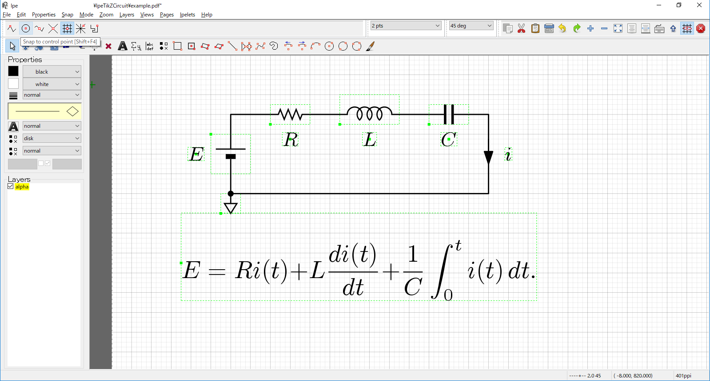

# IpeTikZcircuit
IpeTikZcircuitは，ドロー系画像作成ソフトウェアIpeの上で使用する，回路図記号を描画するためのスタイルファイルです。

拙作pscircuit.styの描画エンジンをPostScriptからTikZに変更し，Ipeの助けを借りてWYSIWYG環境で実現したものです。

使用例を下図に示します。



# 特徴
高品位なドロー系画像作成ソフトウェアとして名高い**Ipe**を**回路図エディタ**にできる！！！！

**WYSIWYG**で使いやすい！

**日本式の回路図記号**かつとっても綺麗！！！！

TikZの利用により図の描画が爆速！

# 導入方法
(2019.2.28 isyファイルを作成したので更新)

IpeのスタイルファイルであるisyファイルとLaTeXのスタイルファイルであるstyファイルの2種類が提供されています。
お好みの方をご利用ください。

## isyファイルを利用する場合（速くて楽）
1. LaTeX，TikZとIpeを使用可能にしておく。

2. メニューのEdit -> Style sheetsでIpe style sheetsウインドウを表示し，add -> ファイルダイアログでipetikzcircuit.isyを探して選択する。

3. Ipe style sheetsウインドウの左側のテキストボックスにipetikzcircuitが追加されていることを確認して，Okボタンで閉じる。

4. Enjoy!!

## styファイルを使用する場合
1. LaTeX，TikZとIpeを使用可能にしておく。

2. ipetikzcircuit.styをtexmfツリーのどこか，または本スタイルファイルを適用したいファイルのあるディレクトリに設置する。

3. IpeにおいてメニューのEdit -> Document propertiesでIpe document propertiesウインドウを表示し，Latex preambleのテキストボックスに
```\usepackage{ipetikzcircuit}```
と書き，Okボタンで閉じる。

4. Enjoy!!

# コマンド使用方法

現在のversionで使用可能な全てのコマンドの使用方法を説明します。

これらのコマンドで回路図記号をIpeのlabelに入力し，配線や接続点，文字などをIpeの機能（折れ線，点，label等）で記述します。

例えば，labelのテキストを \itcR とすると，ラベルに抵抗が描画されます。

* `\itcR`<br>
    抵抗を描画する。

* `\itcVR[#1]`<br>
    引数:<br>
        #1 tを指定すると矢印の先が丁字の半固定抵抗。省略時は可変抵抗。

    3端子の可変，半固定抵抗を描画する。

* `\itcC`<br>
    コンデンサを描画する。

* `\itcCC`<br>
    電解コンデンサを描画する。
    +記号はIpeの機能で適当に入れてください。

* `\itcL[#1](#2)[#3]`<br>
引数:<br>
        #1 巻数。1以上の整数。省略不可。<br>
        #2 中間タップを出す位置。始点に近いターン頂点を1とする自然数をタップの数だけ`,' 区切
りで入力する。タップがない時は省略。<br>
        #3 鉄心の線を書く本数。0，1，2の何れか。ない時は省略可能。

    コイルを描画する。

* `\itcZ`<br>
    四角い抵抗，インピーダンスを描画する。

* `\itcBATT[#1]`<br>
    引数:
        #1 電池の数。1の時は省略可能。

    電池を描画する。

* `\itcGND[\#1]`<br>
    引数:
       #1 GND記号の種類。s（信号GND），c（筐体GND），e（大地に接地）の3種。省略不可。

    GND記号を描画する。

* `\itcMeter[\#1]`<br>
    引数:
       #1 丸の中に描画する文字列。省略不可。

    電圧計，電流計など丸囲み文字の回路図記号を描画する。

* `\itcCurrent`<br>
    電流源を描画する。

* `\itcAC_h`<br>
    交流電圧源を描画する。横向きに端子が出る。

* `\itcAC_v`<br>
    交流電圧源を描画する。縦向きに端子が出る。

* `\itcSW[#1][#2]`<br>
    引数:<br>
        #1 接点の種類。a（単極単投NO），b（単極単投NC），c（単極双投）<br>
        #2 #1がcの時のみ指定する。r（閉じている接点の向きがコモン接点から見て右），l（左）。

    オルタネート型のスイッチを描画する。

* `\itcpushSW[#1][#2]`<br>
    引数:<br>
        #1 接点の種類。a（単極単投NO），b（単極単投NC），c（単極双投）<br>
        #2 #1がcの時のみ指定する。r（共通接点が右），l（左）のどちらか一方と，t（閉じている接点が上），b（下）のどちらか一方をそれぞれ指定する。

    モーメンタリ型のスイッチを描画する。

* `\itcD`<br>
    ダイオードを描画する。

* `\itcZD`<br>
    ツェナーダイオードを描画する。

* `\itcSBD`<br>
    ショットキーバリアダイオードを描画する。

* `\itcVCD`<br>
    可変容量ダイオードを描画する。

* `\itcLED`<br>
    発光ダイオードを描画する。

* `\itcPD`<br>
    フォトダイオードを描画する。

* `\itcSCR[#1]`<br>
    引数:<br>
        #1 アノードから見たゲートの向き。l（左），r（右）

    サイリスタを描画する。

* `\itcTR[#1][#2]`<br>
    引数:<br>
        #1 構造。n（NPN型），p（PNP型）<br>
        #2 ベースから見たエミッタの向き。l（左），r（右）

    トランジスタを描画する。

* `\itcFET[#1][#2]`<br>
        #1 構造。n（Nチャネル），p（Pチャネル）<br>
        #2 ゲート，ソースの位置。l（左），r（右），c（中央）

    接合型FETを描画する。

* `\itcMOSFET[#1][#2][#3][#4]`<br>
        #1 基礎構造。n（Nチャネル），p（Pチャネル）<br>
        #2 チャネルの構造。e（エンハンスメント型），d（デプレッション型）<br>
        #3 ゲート，ソースの位置。l（左），r（右），c（中央）<br>
        #4 #3がcの時のみ指定する。それ以外の時は省略。ゲートから見たソースの向き。l（左），r（右）

    MOSFETを描画する。

* `\itcMOSTR[#1]`<br>
        #1 構造。n（Nチャネル），p（Pチャネル）

    MOSFETの簡易表記を描画する。

* `\itcIGBT[#1][#2][#3]`<br>
        #1 構造。n（Nチャネル），p（Pチャネル）<br>
        #2 ゲート，ソースの位置。l（左），r（右），c（中央）<br>
        #3 #2がcの時のみ指定する。それ以外の時は省略。ゲートから見たソースの向き。l（左），r（右）

    IGBTを描画する。

* `\itcOPAMP[#1][#2]`<br>
        #1 入力端子の向き。l（出力端子から見て+が左），r（右）<br>
        #2 電源端子の有無。v （両側），l（出力端子から見て左側のみ），r（右側のみ），省略（なし）

    オペアンプを描画する。

